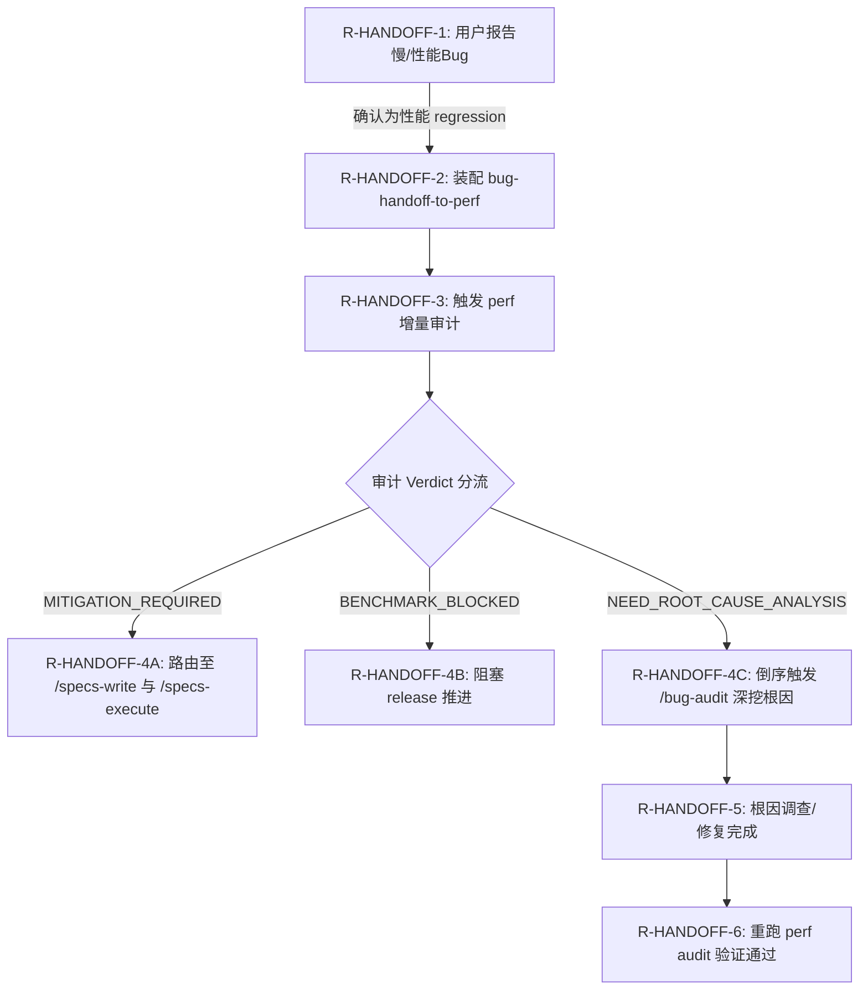

# 缺陷审计交接协议 (Bug-Audit Handoff Protocol)

> 与 `/bug-audit` 性能 regression 联调 / 倒序触发规则；`/performance-reliability-audit` Phase 1 + Phase 7 跑这些规则。决策来源：第 2 问"全三者：spec gate + 定期 + bug 触发"。

---

## 1. 双向 handoff 规则表

| ID | 当前状态/事件 | 执行动作 | 下一步 | 来源 |
| ---- | ------------- | ---------- | ------- | ------ |
| R-HANDOFF-1 | 用户报告"慢" / 性能 bug | `/bug-audit` 接收，执行复现、影响面与严重性评估 | 若确认为性能 regression，转 `R-HANDOFF-2`；否则不启动 perf | §1 |
| R-HANDOFF-2 | 确认为性能 regression | 装配 `bug-handoff-to-perf.md` packet (详 §2.1) | 触发 `/performance-reliability-audit` (trigger=bug-handoff)，转 `R-HANDOFF-3` | §1 |
| R-HANDOFF-3 | 接收到 `bug-handoff` 触发 | 跑增量审计：Phase 1 → 3 → 7 → 8，计算与现有 baseline 偏差 | 根据审计结果 verdict 分流，转 `R-HANDOFF-4` | §1 |
| R-HANDOFF-4A | 审计 Verdict = `MITIGATION_REQUIRED` | 输出 perf packet 与 mitigation tasks | 路由至 `/specs-write` 与 `/specs-execute` 执行修复 | §1 |
| R-HANDOFF-4B | 审计 Verdict = `BENCHMARK_BLOCKED` | 产生阻塞信号 | 立即阻塞发布（若 release 进行中） | §1 |
| R-HANDOFF-4C | 审计 Verdict = `NEED_ROOT_CAUSE_ANALYSIS` | 根因不明，装配 `perf-handoff-to-bug.md` (详 §2.2) | 倒序触发 `/bug-audit` 深挖根因 (cache/N+1/锁)，转 `R-HANDOFF-5` | §1 |
| R-HANDOFF-5 | `/bug-audit` 根因深挖完成并生成修复方案 | 路由至 `/specs-execute` 执行修复并合并代码 | 修复完成后触发重跑 perf audit Phase 2-7，转 `R-HANDOFF-6` | §1 |
| R-HANDOFF-6 | 重跑 perf audit 偏差 < 5% | 验证通过，更新 baseline 快照 | 推进/结束审计 | §1 |

### 1.1 双向 handoff 流程图 (辅助可视化)



---

## 2. Handoff Packet 格式

### 2.1 从 /bug-audit 入本 workflow 的 packet

bug-audit 装配后传给本 workflow 的 packet（`bug-handoff-to-perf.md`）：

```yaml
handoff_id: BUG-PERF-<slug>-<date>-<seq>
from_workflow: /bug-audit
to_workflow: /performance-reliability-audit
trigger_mode_for_target: bug-handoff

bug_report:
  bug_id: BUG-2026-05-24-001
  title: "OAuth login p95 上升 3 倍"
  reported_at: 2026-05-24T10:00:00Z
  reporter: user / system / monitoring
  description: ...

reproduction:
  steps: [...]
  reproducibility: 100% / intermittent / load-dependent
  test_environment: <list>
  reproducibility_command: <command>

impact_assessment:
  affected_users_estimate: 60% of OAuth login attempts
  business_impact: login conversion 下降 8%
  related_paths: [/auth/google/callback]

severity: Critical | High | Medium | Low

regression_evidence:
  baseline_period: 2026-04 (median p95 = 800ms)
  current_period: 2026-05-24 (median p95 = 2400ms)
  change_correlation:

    - 2026-05-20: deployed feature X
    - 2026-05-22: data volume 增长 30%
    - 2026-05-23: dependency upgrade Y
  
nfr_perf_links:

  - NFR-PERF-001 (likely violated)
  - NFR-PERF-002 (possibly violated)

requested_audit_scope:
  paths: [/auth/google/callback]
  metrics: [latency-p95, latency-p99]
  comparison_window: last 30 days

requested_audit_phases: [1, 3, 7, 8]  # 跳过 2/4/5/6

baseline_to_use: <slug>/perf-audit/baseline.json (currently v3)
```

### 2.2 从本 workflow 倒序触发 /bug-audit 的 packet

若 audit 发现 regression 但根因不明，倒序 handoff 给 bug-audit 深挖根因（`perf-handoff-to-bug.md`）：

```yaml
handoff_id: PERF-BUG-<slug>-<date>-<seq>
from_workflow: /performance-reliability-audit
to_workflow: /bug-audit
trigger_mode_for_target: perf-regression-root-cause

audit_evidence:
  audit_id: PERF-oauth-google-login-2026-05-24-002
  packet_ref: <slug>/perf-audit/regression-report.md
  verdict: REGRESSION_MAJOR
  
regression_pattern:
  affected_metrics:

    - NFR-PERF-001: 38% degradation (795ms → 1100ms p95)
  pattern_signature:
    - latency 阶跃增加（非渐变）
    - 与 release rel-2026-05-20 时间相关
    - DB query count 未变
    - memory footprint 未变
  
hypothesized_root_causes:

  - cache miss rate increased
  - new code path 引入 N+1
  - dependency Y 性能 regression
  - data volume 增长导致 query 慢

requested_investigation:
  paths_to_profile: [/auth/google/callback]
  profiling_tools: [pprof, flamegraph, DB EXPLAIN]
  comparison_baseline: 2026-04 baseline
  
nfr_perf_links: [NFR-PERF-001, NFR-PERF-002]
```

---

## 3. Trigger 流程

### 3.1 /bug-audit → 本 workflow（性能 regression 分流）

```text

1. /bug-audit Phase 3 (Severity Triage) 判断 bug 类型 = 性能 regression
2. /bug-audit Phase 5 (Routing) 决定 → 路由到 /performance-reliability-audit
3. /bug-audit 装配 bug-handoff-to-perf.md packet (按 §2.1)
4. trigger /performance-reliability-audit:
   - trigger_mode: bug-handoff
   - upstream packet: bug-handoff-to-perf.md
5. 本 workflow Phase 1 读取 packet → 跳到 §3 决策

```

### 3.2 本 workflow → /bug-audit（根因调查）

```text

1. 本 workflow Phase 7 检测 regression 但无明确根因
2. 本 workflow Phase 8 决定:
   - 若 verdict = REGRESSION_MAJOR/CRITICAL 且根因不明 → 倒序 handoff
3. 装配 perf-handoff-to-bug.md packet (按 §2.2)
4. trigger /bug-audit:
   - trigger_mode: perf-regression-root-cause
   - upstream packet: perf-handoff-to-bug.md
5. /bug-audit 深挖根因 → 修复 task → 修复完成后重跑本 workflow Phase 2-7

```

---

## 4. Phase 跳过规则（trigger=bug-handoff）

```text

Phase 1: ✅ 必跑 - 读 packet + 确认 NFR-PERF 契约
Phase 2: ❌ 跳过 - 用现有 baseline（packet 中已指定）
Phase 3: ✅ 必跑 - 仅相关路径 (按 packet.requested_audit_scope.paths)
Phase 4: ❌ 跳过 - bug-handoff 不跑 load test
Phase 5: ❌ 跳过 - bug-handoff 不跑 capacity
Phase 6: ❌ 跳过 - bug-handoff 不跑 SLA
Phase 7: ✅ 必跑 - 计算与 baseline diff
Phase 8: ✅ 必跑 - 装配 packet + handoff

```

例外：若 bug 报告涉及多个 NFR-PERF 维度（如同时涉及 latency + capacity），临时升级 trigger mode 到 `spec-gate` 等价跑全 Phase。

---

## 5. 共同根因分类

| 根因类别 | 典型 signature | 谁负责调查 |
| --------- | --------------- | ----------- |
| **Cache miss** | hit rate 下降 / 冷启动 / 缓存键变更 | `/bug-audit` |
| **N+1 query** | DB query count 增加 / 关联查询 | `/bug-audit` |
| **GC pressure** | memory growth / GC pause 增加 | `/bug-audit` |
| **Lock contention** | 阻塞 / 死锁 / 锁等待 | `/bug-audit` |
| **Connection pool 耗尽** | 等待连接 / connection timeout | `/bug-audit` |
| **External API slowdown** | 依赖响应慢 | `/bug-audit` + 联系外部依赖方 |
| **Data growth** | query 慢但代码未变 / 数据量增长 | `/architecture-audit`（partition / archive 决策） |
| **Dependency upgrade** | 升级后 regression | `/bug-audit` + 评估回滚 |
| **Algorithm complexity** | O(n²) 隐藏在小数据下未暴露 | `/bug-audit` + `/architecture-audit` |
| **Network / infra** | 跨区域 latency 增加 | `/observability-incident` + infra team |

每类根因有典型 mitigation pattern；本 workflow 不直接修，但出 mitigation task 时引用对应类别。

---

## 6. handoff 失败模式

| 失败模式 | 描述 | 处置 |
| --------- | ------ | ------ |
| **Packet 字段缺失** | bug-handoff packet 缺 NFR 链接 / baseline ref | 回 `/bug-audit` 补字段 |
| **NFR-PERF 不存在** | bug 涉及路径无对应 NFR-PERF 契约 | 回 `/specs-write` 补 NFR + 重新分流 |
| **Baseline 已过期** | packet 指定的 baseline 不可用 | 跳过 Phase 2 跳过条件，refresh baseline 后再跑 |
| **倒序循环** | bug-audit ↔ perf 相互无限分流 | 用户介入裁决 + 升级到 architecture-audit |
| **根因调查超时** | bug-audit 调查 > 1 周 | 升级到 architecture-audit + 临时 mitigation |

---

## 7. 与其他 workflow 边界（在 handoff 期）

| 触发关系 | 主导 workflow | 协同 workflow |
| --------- | -------------- | -------------- |
| 用户报告"慢" | `/bug-audit`（接收 + 评估） | 本 workflow（性能数据补充） |
| 性能 alert 触发 | `/observability-incident`（事故响应） | 本 workflow（regression 评估）+ `/bug-audit`（根因） |
| Spec close-out 性能审计 | 本 workflow（spec-gate） | `/bug-audit` 仅在发现根因不明时倒序触发 |
| Canary 期 regression | 本 workflow（canary-feedback） | `/bug-audit` 仅在调查阶段 |
| 容量耗尽预警 | 本 workflow（capacity） | `/architecture-audit`（架构调整） |

---

## 8. 修订规则

- 本文修订必须同 PR 修订 `audit-protocol.md` Phase 1（trigger 表）+ `<ba>` 相关 phase（若 bug-audit 增加 perf 路由章节）。
- handoff packet schema 变更 → 双向同步（bug-audit 与本 workflow）+ 提供迁移脚本。
- 根因分类表（§5）扩展 → 同步 `<ba>` 根因分类表 + mitigation 模板。
- 倒序循环检测规则不允许放宽（防无限分流）。
