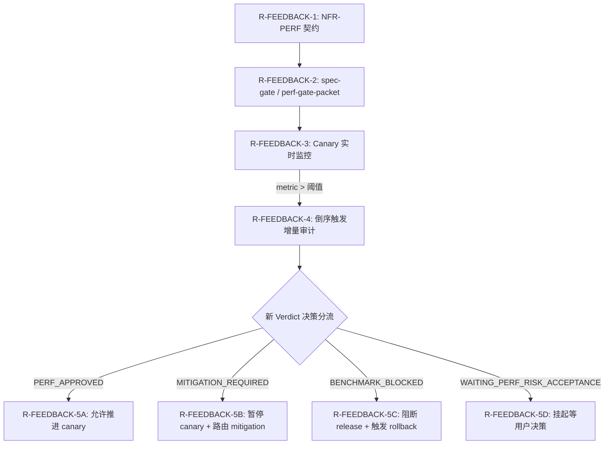

# Canary Feedback Protocol

> 与 `/release-deploy` canary 期实时 metric 反馈环；`/performance-reliability-audit` Phase 7 + Phase 8 跑这些规则。决策来源：第 3 问"双向门 + canary 反馈环"。

---

## 1. 反馈环流转规则表

| ID | 当前阶段/事件 | 条件 (If) | 动作 (Then) | 下一步/流转状态 |
| ---- | ------------- | ----------- | ------------ | --------------- |
| R-FEEDBACK-1 | 需求规格定义 | 识别到高风险 NFR-PERF | 声明性能契约 | 路由至 `/performance-reliability-audit` 执行 spec-gate |
| R-FEEDBACK-2 | 发布交付前 | spec-gate 审计完毕且 Verdict = `PERF_APPROVED` | 产出 `perf-gate-packet.md` 作为 release gate 凭证 | 路由至 `/release-deploy` 进行 R-RDY-10 验证并启动 canary |
| R-FEEDBACK-3 | Canary 灰度期 | 实时监控指标且 metric > 阈值 (详 §3.1) | 立即倒序触发本 feedback | 路由至 `/performance-reliability-audit` (canary-feedback trigger) |
| R-FEEDBACK-4 | 倒序触发评估 | 启动增量审计 (Quick/Full increment) | 计算与 baseline 偏差并生成新 packet | 根据新 packet Verdict 分流至 R-FEEDBACK-5A/B/C/D |
| R-FEEDBACK-5A | 评估结论 | 新 Verdict = `PERF_APPROVED` (偏差在范围内) | 允许推进、不阻塞 canary | 推进 canary 至下一阶段 |
| R-FEEDBACK-5B | 评估结论 | 新 Verdict = `MITIGATION_REQUIRED` (REGRESSION_MAJOR) | 暂停 canary 推进，产出临时 mitigation tasks | 路由至 `/specs-write` 与 `/specs-execute` 修复 |
| R-FEEDBACK-5C | 评估结论 | 新 Verdict = `BENCHMARK_BLOCKED` (REGRESSION_CRITICAL) | 产生阻塞信号并立即阻断 release 进程 | 通知 `/release-deploy` 执行 rollback (CONFIRMED_ACTION) |
| R-FEEDBACK-5D | 评估结论 | 新 Verdict = `WAITING_PERF_RISK_ACCEPTANCE` | 暂停 canary 推进并挂起流程 | 等待用户决策 (Gate B / C) |

### 1.1 反馈环流程图 (辅助可视化)



---

## 2. Canary 期实时 metric 来源

### 2.1 Metric source 优先级

| 优先级 | 来源 | 抓取频率 |
| ------- | ------ | --------- |
| P1 | release-deploy canary metric endpoint（推荐） | 1 min |
| P2 | application metric / OpenTelemetry | 1 min |
| P3 | LB / API gateway p95 dashboard | 5 min |
| P4 | error log 频率 | 5 min |

### 2.2 Metric 字段

```yaml
canary_metric:
  feature_slug: oauth-google-login
  release_id: rel-2026-05-24-001
  canary_phase: 5%  # 流量比例
  metric_window: last_5_min
  
  metrics:

    - nfr_id: NFR-PERF-001
      sli: latency-p95
      baseline: 795ms
      budget: 800ms
      current: 1100ms
      diff_pct: 38%
      verdict: REGRESSION_MAJOR
    
    - nfr_id: NFR-PERF-002
      sli: cold-start
      baseline: 1.2s
      budget: 1.5s
      current: 1.4s
      diff_pct: 16.7%
      verdict: REGRESSION_MINOR

```

---

## 3. 反馈环阈值表

### 3.1 倒序触发阈值（canary metric → 触发本 workflow）

| Canary Phase | Trigger Threshold | Action |
| -------------- | ------------------ | -------- |
| 1% | metric > budget × 1.5 OR diff_pct > 30% | 立即倒序触发 |
| 5% | metric > budget × 1.3 OR diff_pct > 25% | 立即倒序触发 |
| 25% | metric > budget × 1.2 OR diff_pct > 20% | 立即倒序触发 |
| 50% | metric > budget × 1.1 OR diff_pct > 15% | 立即倒序触发 |
| 100% | metric > budget × 1.05 OR diff_pct > 10% | 30 分钟内触发 |

### 3.2 Trigger 命中后的 audit 路径

```text

canary metric > threshold (per §3.1)
  ↓
canary-feedback-protocol §3.3 决定 increment 类型
  ↓
trigger /performance-reliability-audit (trigger=canary-feedback)
  ↓
跳到 audit-protocol Phase 1 → 7（增量）→ 8 (新 packet)
  ↓
若新 packet verdict = BENCHMARK_BLOCKED → 阻塞 canary + 通知 release-deploy 触发 rollback
若新 packet verdict = MITIGATION_REQUIRED → 暂停 canary 进展 + 出 mitigation
若新 packet verdict = WAITING_PERF_RISK_ACCEPTANCE → 等用户裁决
若新 packet verdict = PERF_APPROVED → 继续 canary 推进

```

### 3.3 Increment audit 类型

| 类型 | 范围 | 跳过哪些 Phase |
| ------ | ------ | --------------- |
| **Quick increment**（默认） | 仅相关 NFR-PERF | 跳过 Phase 2 (用现有 baseline) + Phase 4/5/6 |
| **Full increment**（多 NFR 大幅 regression） | 全部 NFR-PERF | 跳过 Phase 4/5/6（除非 NFR 涉及） |
| **Full re-audit**（架构级问题） | 全部 + 重审架构 | 跑全 Phase + 路由 architecture-audit |

默认 Quick increment；只有用户 explicit 要求或多 NFR 同时大幅 regression 才升级。

---

## 4. canary-feedback-log.md 模板

```markdown
## 金丝雀性能回归回溯日志 (Canary Feedback Log) — PERF-<slug>-<date>-<seq>

## 触发源信息 (Trigger Source)

- 发版发布 ID (Release ID): rel-2026-05-24-001
- 关联 Feature 标识 (Feature slug): oauth-google-login
- 当前金丝雀比例阶段 (Canary phase): 5%
- 触发时刻 (Trigger time): 2026-05-24T16:30:00Z
- 触发来源 (Triggered by): release-deploy 金丝雀实时监控告警 (canary monitoring)

## 超标/回溯指标命中 (Threshold Hit)
|  | 性能契约 (NFR-PERF) | 性能基线 (Baseline) | 指标预算 (Budget) | 金丝雀当前值 (Canary Current) | 偏移幅度 (Diff %) | 预警触发阈值 (Threshold) | 结论 (Verdict) |  |
|  | ---------- | ---------- | -------- | ---------------- | -------- | ----------- | --------- |  |
|  | NFR-PERF-001 | 795ms | 800ms | 1100ms | +38% | 25% (在 5% 阶段) | 触发告警 (HIT) |  |
|  | NFR-PERF-002 | 1.2s | 1.5s | 1.4s | +16.7% | 25% (在 5% 阶段) | 未触发 (NOT HIT) |  |

## 增量审计/追溯决策 (Increment Audit Decision)

- 增量审计模式 (Type): 快速增量审计 (Quick increment - 仅针对 NFR-PERF-001)
- 运行步进阶段 (Phases to run): Phase 1 + 3 (仅 NFR-PERF-001) + 7 + 8
- 跳过步进阶段 (Phases skipped): 2 (现有 baseline 仍有效) / 4 / 5 / 6

## 审计周期与结论 (Audit Cycle)

- 审计 ID (Audit ID): PERF-oauth-google-login-2026-05-24-002
- 审计开始时间 (Started): 2026-05-24T16:32:00Z
- 审计完成时间 (Completed): 2026-05-24T16:55:00Z
- 回归诊断结论 (Verdict): 严重性能回归 (REGRESSION_MAJOR - 路由至削减修复)
- 回归归档信息包 (Packet): <slug>/perf-audit/perf-canary-regression-packet.md

## 已采取的熔断/止血行动 (Action Taken)

- 金丝雀灰度发布计划暂停在 5% 水位 (canary 进展暂停在 5%)
- 熔断改善任务 TASK-CANARY-1 已创建 (mitigation task TASK-CANARY-1 创建)
- On-call 运维责任人已被紧急通知（按 NFR-OBS-001 路由 (routing) 规则）
- 用户确认授权记录 (CONFIRMED_ACTION)：<待用户填>

## 异常消减与闭环 (Resolution)

- 缺陷修复提交 (修复完成，附 commit sha):
- 重跑金丝雀灰度验证 (重跑 canary):
- 金丝雀按步进比例继续推进 (canary 推进到 25% / 50% / 100%):
- 归档金丝雀回归日志 (关闭 canary feedback log):

## 双向关联追溯 (Cross-Reference)

- 上游发版事实 (上游 release-deploy): rel-2026-05-24-001
- 上游规格门禁事实 (上游 spec-gate audit): PERF-oauth-google-login-2026-05-24-001
- 下游削减/改善任务 (下游 mitigation task): <link>
- 下游架构审计 (下游 architecture-audit - 如适用): N/A

```

---

## 5. 与 release-deploy 集成点

### 5.1 release-deploy 必须做的（上游契约）

- canary 期暴露 metric endpoint（标准格式）
- canary phase 转换前轮询本 workflow packet 状态
- 接收 BENCHMARK_BLOCKED 信号 → 触发 rollback
- 接收 MITIGATION_REQUIRED 信号 → 暂停 canary 进展
- 提供 canary phase 钩子（1% / 5% / 25% / 50% / 100%）

### 5.2 本 workflow 必须做的（下游契约）

- 提供 perf-gate-packet.md 给 R-RDY-10
- 注册 canary feedback monitor（按 §6 注册流程）
- 接收 release-deploy 倒序 trigger 后立即增量 audit
- 输出 canary-feedback-log.md + 新 packet
- 通知 release-deploy verdict（PERF_APPROVED / BENCHMARK_BLOCKED / MITIGATION_REQUIRED）

### 5.3 注册流程（spec-gate 期完成）

```text

1. spec-gate audit Phase 8 closeout 时:
   注册 canary feedback monitor 到 release-deploy:
     - feature_slug
     - 关键 NFR-PERF 列表
     - threshold 表（按 §3.1）
     - audit cycle ID
2. release-deploy R-RDY-10 验证时确认注册存在
3. canary 启动后开始 polling metric endpoint
4. metric > threshold → trigger 本 workflow

```

---

## 6. 与 observability-incident 边界

| 事项 | 归属 |
| ------ | ------ |
| Canary 期 alert 触发（如 5xx 增加 / latency 抖动） | `/observability-incident` |
| Canary 期 perf metric > threshold | 本 workflow（canary-feedback trigger） |
| Canary 期事故响应 / runbook | `/observability-incident` |
| Canary 期性能 regression 验证 | 本 workflow |

边界判定：alert 是被动响应，本 workflow 是主动审计；同一个事件可能两者都触发，但责任不同：

- obs：止血 + runbook
- 本 workflow：建立证据链 + 决定 verdict + 阻塞 / 通过 release

---

## 7. 失败模式

| 失败模式 | 描述 | 处置 |
| --------- | ------ | ------ |
| **Canary metric endpoint 不可达** | release-deploy 没暴露 metric | 回 `/release-deploy` 修上游契约 |
| **Threshold 表不存在** | spec-gate 期未注册 monitor | 阻塞 canary（回 spec-gate audit） |
| **Audit 反应过慢**（threshold 命中后 audit > 30 min） | 本 workflow 性能问题 | 升级 audit 优先级 + 本身性能优化 |
| **重复倒序触发** | 同一 audit cycle 内多次 threshold 命中 | 防抖（5 分钟内多次命中合并） |
| **Canary 已完成（100%）后 metric > threshold** | post-deploy regression | 触发 `POST_AUDIT_REGRESSION_DETECTED`（不是 canary-feedback） |

---

## 8. 修订规则

- 本文修订必须同 PR 修订 `audit-protocol.md` Phase 7 + Phase 8 + `../../release-deploy/canary-protocol.md/`（若存在）。
- threshold 表调整 → 必须命中 `HG-AUDIT-PERF-THRESHOLD`（建议用户批准）。
- metric source 新增（如 RUM）→ 同步更新 §2.1 优先级表。
- canary phase 列表变更（1% / 5% / 25% / 50% / 100%）→ 必须与 release-deploy canary protocol 一致。
